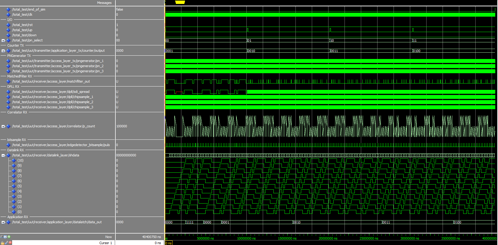
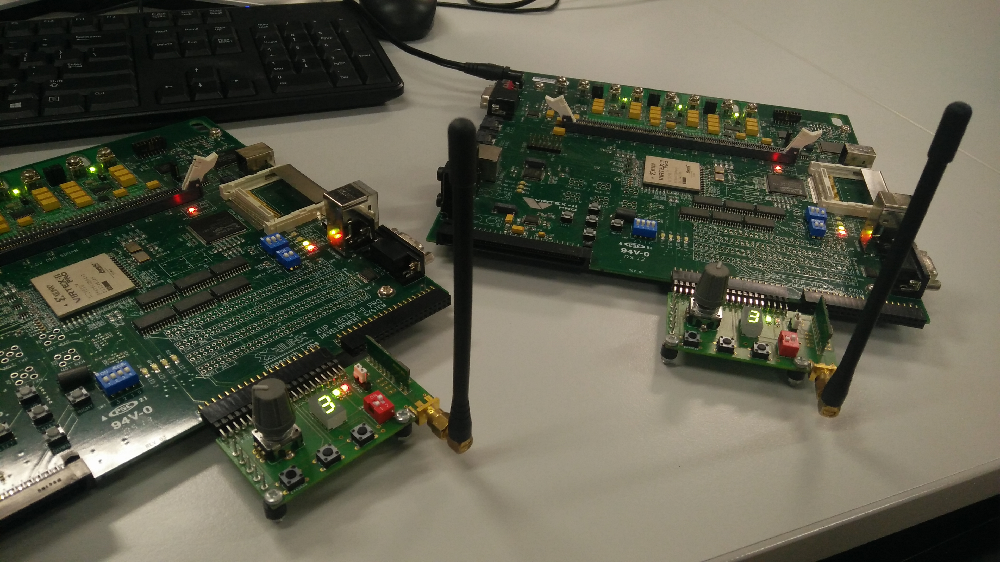
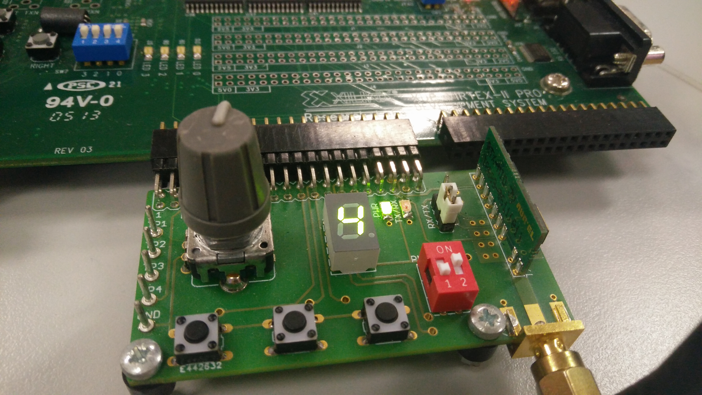

# DSSS Wireless Transmit-Receive System
This repository contains the VHDL files for the course "Digital Synthese: practica" by Jan Meel (KU Leuven, Campus De Nayer).

## Files
- Total (top file)

- Transmitter (top file)
	- access layer: PNGenerator, MUX
	- datalink layer: SequenceController, DataRegister
	- application layer: EdgeDetector, UpDownCounter, Debouncer, SegDecoder

- Receiver (top file)
	- access layer: SegDecoder, DataLatch
	- datalink layer: DataShiftReg
	- application layer: DPLL, MatchedFilter, Correlator, Despreader, MUX, PNGenerator, Edgedetector

- Hardware
	- transmitter: Xilinx UCF file, Transmitter hardware top file
	- receiver: Xilinx UCF file, Receiver hardware top file

## Testbench (total_test.vhd)

## Result
A fully working DSSS Wireless Transmit-Receive System with 3 different PN codes.

<h1 align="center">

</h1>
<h1 align="center">

</h1>
<h1 align="center">

</h1>

## License
Everything in this repository is available under the GPLv3 License.
